# Air Flow Site Instructions

Access the site here: http://165.232.158.103/inputs

### Status Indicators
- Green: This step has been completed
- Blue: This is the current step that needs to be completed to move forward
- Grey: This step is not yet available, and requires a previous step to be completed first
- Note: If an earlier step is re-done, all following steps will be reset. For example, If the analysis domain is edited, but the correction factors were already defined, these will need to be input again. The status colour will reflect this  
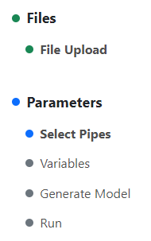  
*In this example, the user has uploaded the initial input files, and must now select the analysis domain with the Select Pipes page*

## Manage Cases
- Multiple cases can be created with different input files and settings, and each case stores its own separate output. 
- To create a new case, click the "Create Case" button, and give it a unique name. 
- Cases can be deleted by clicking the red trashcan icon. Be careful, this will delete all files and settings associated with this case, including output

## File Upload
- Click on "File Upload"  
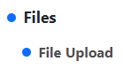
- Upload the three main input files (Pipe Information, Manhole Information, Raw Water Flow Data)  
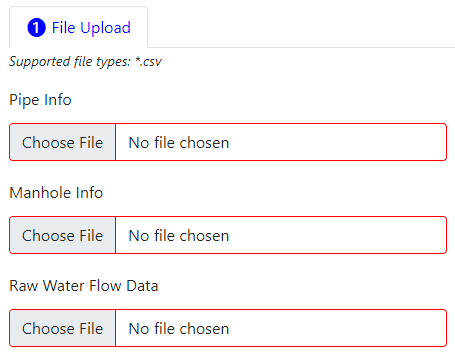
- Choose each file with the file selection buttons, then click the Upload button to upload all three files  

- If you have already uploaded these files, the site will ask if you want to overwrite them  
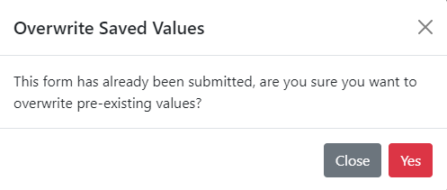

## Select Pipes
- Click on "Select Pipes"
- On this page, you will select the subset of pipes that will make up the analysis domain
- Pipes can be selected using **one of** three methods: Boundary Coordinates, Specified Pipe IDs, or by drawing a polygon on a map
- To use either of the first two methods, use the file selection buttons to select **either** a GIS Boundary Coordinates file, or a Specified Pipe IDs file. Leave the other selection blank, and click Upload.  
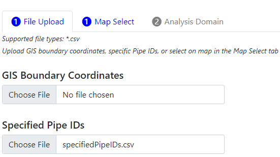  
*In this example, a Specified Pipe IDs file was used, and the GIS Boundary Coordinates file selection was left blank*
- To use the map selection tool, click the "Map Select" tab.
    - The tool will load the entire pipe map. Be patient, this may take a few moments
    - Move and zoom the map until you've found the desired area, then click the "Draw a Polygon" button on the top left  
    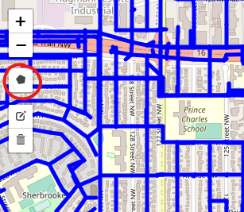
    - Click around the map to draw a polygon that will define the analysis area. To finish drawing the polygon, click on the first point you made. This will close off the polygon.  
    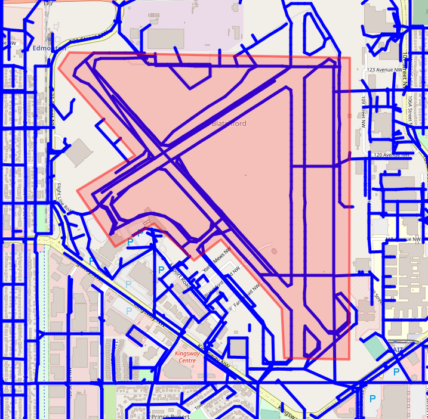
    - Only one region may be defined. If you click on "Draw a Polygon" again, you may draw another polygon, but the first one will be removed.
    - To edit the existing polygon, click the "Edit Layers" button. You can then move the corner points to edit the region. A "ghost" point will also appear in the center of each line. Click and drag this point to create it as a new point. Once done editing, click Save to save the changes, or click Cancel to cancel these changes.  
    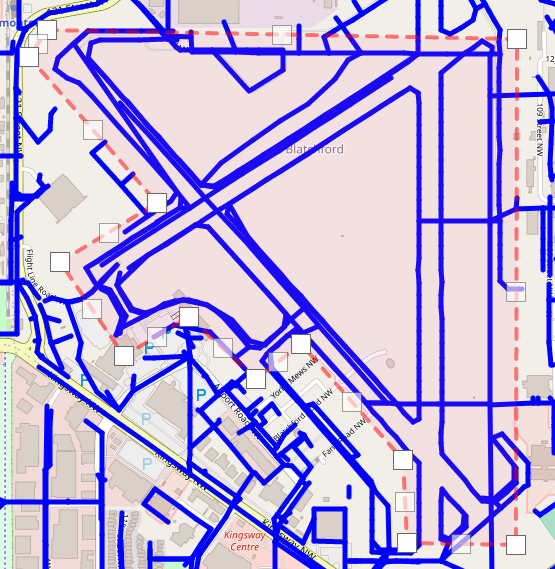
    - Once satisfied with the region, click "Save Selected Pipes"  
    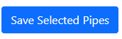
- Click on the "Analysis Domain" tab to view the region you have selected to verify it is correct. 

## Edit Variables
- Click on "Variables"
- Edit the variables that will take effect for all features, unless modified in a further step
- Make any desired changes, then click "Save"

## Correction Factors and Boundary Conditions
- Click on "Generate Model"
- You may view the analysis domain again, but now with features separated into all 6 categories (Drop Manhole, Junction, etc.) 
  - Note: If a certain feature does not appear in the legend in the lower left, it means that no features in this category were included in the domain
- Once you have viewed the analysis domain and decided on correction factors and boundary conditions, switch to the "Correction Factors" page. 
- For each correction factor type, either a file can be uploaded, or the values can be entered on the site.
  - Use the "Manual Input" toggle to switch between these options for each correction factor
- If file upload is used, use the file selector to select the file, then click Save.  
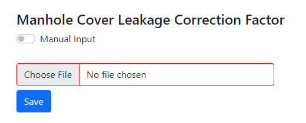
- If Manual Input is used, click add row to add a correction for as many features as desired, then enter the feature ID and the value for each one. Rows can be deleted if they are no longer needed. Click Save once done.  
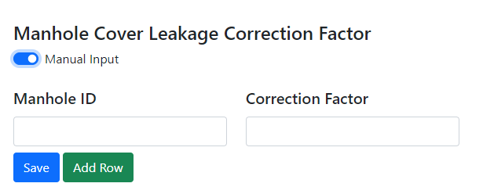
- Note: Whether file upload or manual input is used, "Save" must be clicked for each correction factor
- For boundary conditions, only file upload is supported. 
- Once all correction factors and the boundary conditions have been saved, click "Generate Initial Guess" to prepare the case for solving. 

## Run Solution
- Click "Run" to open this page
- Click "Run Calculation" to start the solver
- The solver will run in the background, you do not need to keep the site open. 
- Click "Get Status" periodically to check if the case has finished processing. 
- Once the case has finished processing, the output files will be available in the "Outputs" section

## View Outputs and Map
- Click "Outputs Table" to open this page
- Output files may be directly downloaded if desired. 
- To view the interactive map, click "View Map"
  - This page will show the analysis domain with relevant calculation results for each feature. Hover over features to view values. 
- Individual feature categories may be selected with the drop-down on the top left  
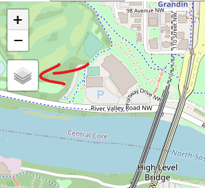